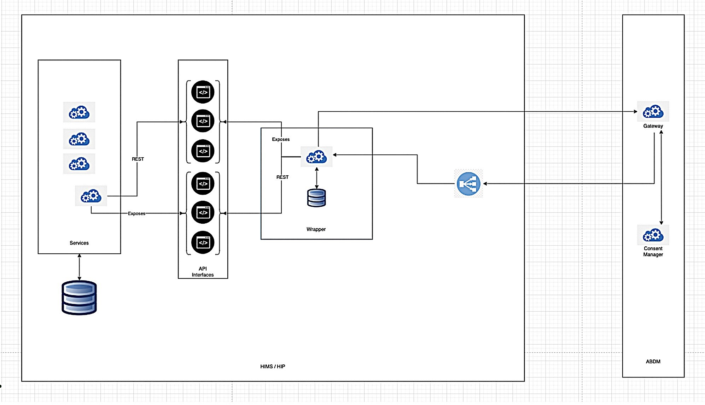

<!-- DO NOT REMOVE - contributor_list:data:start:["VenuAjitesh", "atulai-sg", "NHA-ABDM", "raunaqp"]:end -->
# ABDM Wrapper

> **Note:** This is a customized fork of the original [NHA-ABDM/ABDM-wrapper](https://github.com/NHA-ABDM/ABDM-wrapper), modified and integrated as part of a Quantum-Encrypted, ABDM-Integrated Hospital Data Management System (Final Year Project). See [Customizations Performed](#customizations-performed) below for details on what was changed from the original.

The Ayushman Bharat Digital Mission (ABDM) is a government initiative that aims to develop a digital health infrastructure for India. An overview of ABDM can be found [here](https://github.com/NHA-ABDM/ABDM-wrapper/wiki/ABDM-Overview). The ABDM aims to improve the efficiency and transparency of healthcare data transfer between patients, medical institutions, and healthcare service providers. It also allows patients to securely store their medical information and share with others as needed.
The National Health Authority (NHA) is implementing Ayushman Bharat Digital Mission (ABDM) to create a digital health ecosystem for the country. ABDM intends to support different healthcare facilities like clinics, diagnostic centers, hospitals, laboratories and pharmacies in adopting the ABDM ecosystem to make available the benefits of digital health for all the citizens of India.
In order to make any digital solution ABDM compliant, it has to go through 3 milestones and obtain AND certification.
- Milestone 1: ABHA Id creation, verification and obtaining link token
- Milestone 2: Linking and exporting health data
- Milestone 3: Sending a consent request and importing data from other applications in the ecosystem

ABDM Wrapper is created to solve the challenges and issues faced by integrators to bring their systems into ABDM ecosystem.
Wrapper aims to abstract complex workflows and algorithms exposing clean and simple interfaces for integrators.
Wrapper abstracts implementation of HIP and HIU workflows involved in **Milestone 2** and **Milestone 3**.

---

## Customizations Performed

This fork extends the base ABDM Wrapper with the following changes to support a quantum-encrypted hospital data management system:

### 1. Extended Patient Schema
The default patient schema was extended by introducing an additional `email` field. This field is stored alongside the patient's demographic information and is used by the integrated Node.js backend to perform email-based OTP verification before allowing access to medical records.

### 2. Extended Care Context Metadata
The default ABDM Wrapper care context was enhanced to support metadata required by the Secure Hospital Data System. Each healthcare record was enriched with additional attributes to facilitate secure document retrieval, PACS integration, and quantum key orchestration.

Additional metadata includes:
- Study UID
- Series UID
- HI Type
- Imaging Modality
- Hospital Identifier
- Hospital Name
- PACS Endpoint
- Key Management Entity (KME) Endpoint
- Quantum Key Distribution (QKD) Node Identifier
- IPSec Gateway
- SHA-256 Integrity Hash

These additions allow every care context to carry sufficient information for secure retrieval and verification of clinical resources within the proposed architecture.

### 3. Multiple Healthcare Records per Patient
Instead of a single demonstration record, each patient may contain multiple care contexts representing different healthcare resources such as:
- Chest CT Scan
- Discharge Summary
- Operative Video

This enables the dashboard to demonstrate retrieval of heterogeneous healthcare records associated with a single ABHA address.

### 4. Node.js Backend Integration
The wrapper was integrated with a custom Node.js middleware responsible for:
- Doctor authentication
- Patient lookup using ABHA Address
- Retrieval of patient email
- OTP generation and verification using Gmail SMTP (Nodemailer)
- Secure communication with the React-based Hospital Dashboard

### 5. Mock Gateway Deployment
As official ABDM Sandbox API credentials were unavailable during development, the wrapper was deployed together with the Mock Gateway to emulate ABDM workflows locally. Multiple applications for Sandbox access were submitted; however, API access had already been provisioned to our institution's registered email IDs. We also communicated with the ABDM support team and the Clinical Research Department at Ruby Hall Clinic, but official API access could not be obtained during the project timeline. Consequently, the Mock Gateway was used to simulate ABDM interactions while preserving the architecture and integration workflow of the production ecosystem.

---

## Architecture

